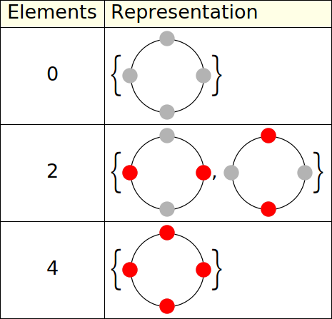
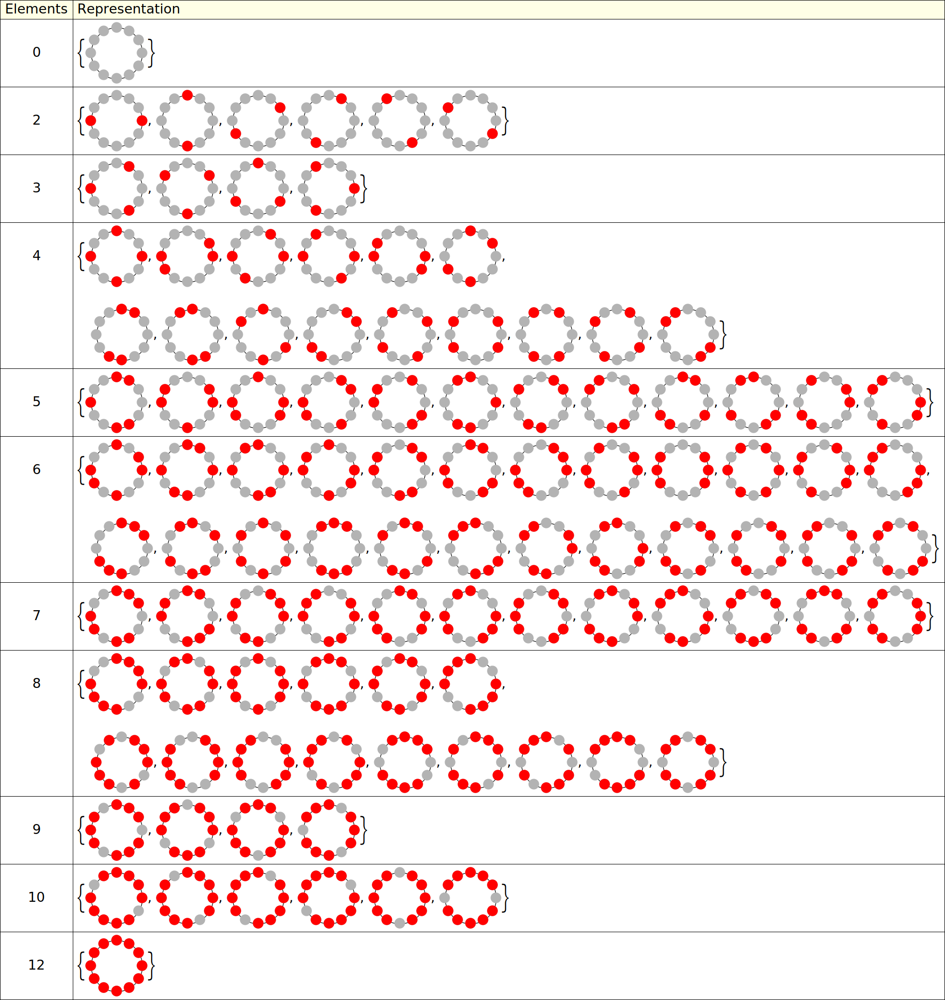
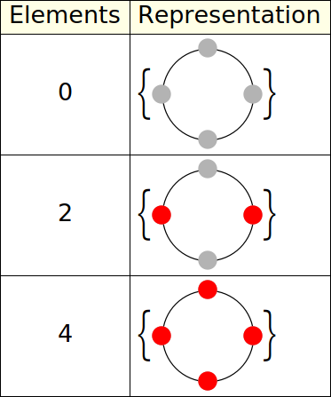
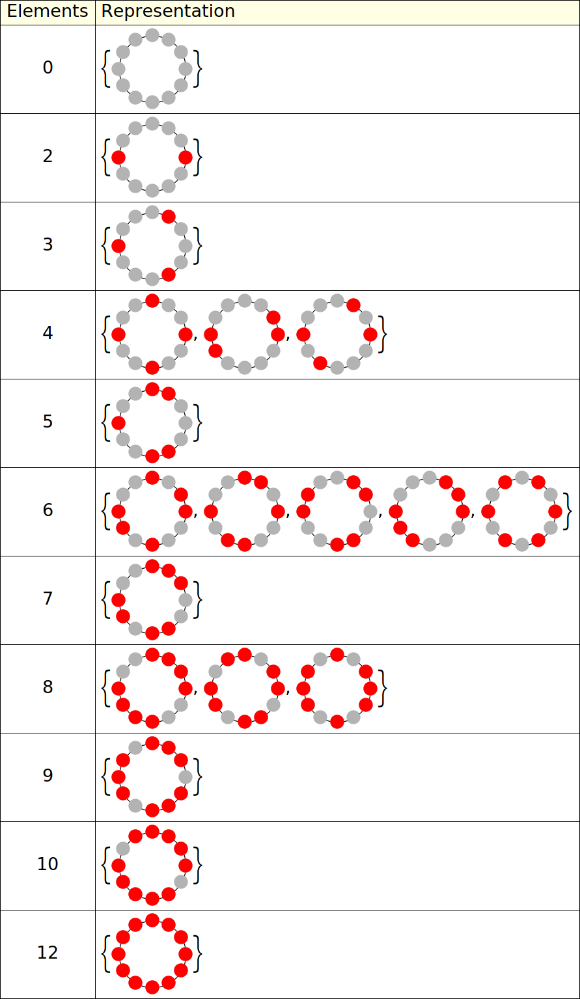

# The Centrifuge Problem 

## Overview

A solution of [the Centrifuge Problem](https://www.youtube.com/watch?v=7DHE8RnsCQ8) in Wolfram Mathematica.

> Given a centrifuge with *n* holes, is it possible to balance *k* test tubes?

This solution, in particular `centrifuge_problem_exhaustive_legacy.nb`, is further explored in by blog: https://aldomann.com/post/the-centrifuge-problem/

## Examples

Below we can see raw solutions for `n=4` and `n=12`.

```mathematica
4 // FindCentrifugeSols // DrawCentrifugeSols
```



```mathematica
12 // FindCentrifugeSols // DrawCentrifugeSols
```



Below we can see unique solutions (under rotation) for `n=4` and `n=12`.

```mathematica
4 // FindCentrifugeSols // ReduceRotations // DrawCentrifugeSols
```



```mathematica
4 // FindCentrifugeSols // ReduceRotations // DrawCentrifugeSols
```


